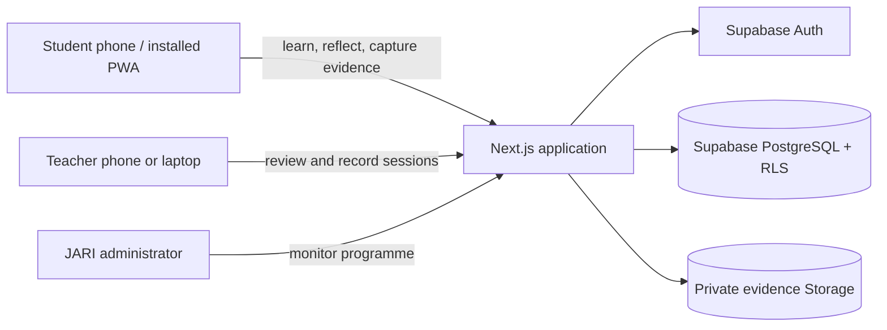
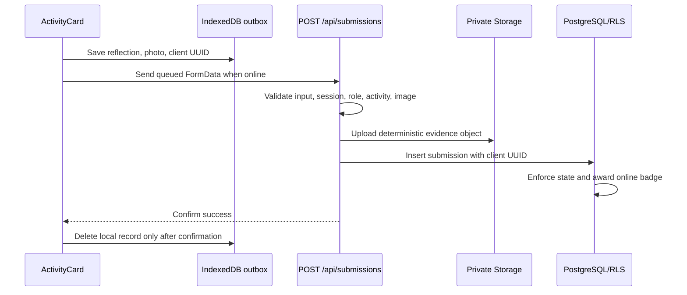

# Architecture

## Purpose and scope

Digital Ocean Passport is an authenticated, mobile-first learning companion for the Laut Sahabat
Kita three-island pilot. Students complete online or field activities, keep reflections and photo
evidence, and earn badges. Teachers review field evidence and record learning sessions. JARI
administrators see programme-level participation and impact.

The application uses the Next.js App Router, React Server Components, TypeScript, Supabase Auth,
PostgreSQL, Row Level Security (RLS), private Supabase Storage, and a service-worker-backed offline
outbox.

## System context

No privileged Supabase service key is used by the application. Browser and server requests use the
signed-in user's session and publishable key, so RLS remains the final authorization boundary.

## Runtime layers

| Layer                         | Location                                                              | Responsibility                                                                                    |
| ----------------------------- | --------------------------------------------------------------------- | ------------------------------------------------------------------------------------------------- |
| Routing and layouts           | `src/app/`                                                            | App Router pages, metadata, role-specific routes, Server Actions, and the submission API.         |
| Server authorization and data | `src/lib/auth.ts`, `src/lib/data.ts`, `src/lib/submissions/server.ts` | Resolve the current profile, enforce route roles, load RLS-scoped data, and validate submissions. |
| Interactive UI                | `src/components/`                                                     | Forms, dialogs, navigation, dashboards, review controls, and PWA status.                          |
| Local persistence             | `src/lib/offline/submission-queue.ts`                                 | IndexedDB outbox, retry state, idempotent client IDs, and foreground sync.                        |
| PWA worker                    | `public/sw.js`                                                        | Static asset caches, offline fallback, Background Sync, and window notifications.                 |
| Localization                  | `src/lib/i18n/`                                                       | Negotiate and persist the reader's language, and resolve typed message dictionaries.              |
| Account provisioning          | `src/lib/accounts/`, `src/lib/supabase/admin.ts`                      | Validate class lists, create student logins with the server-only secret key, and reset PINs.      |
| Session boundary              | `src/proxy.ts`, `src/lib/supabase/proxy.ts`                           | Negotiate the locale, refresh Supabase cookies, and redirect unauthenticated page requests.       |
| Data and policy               | `supabase/schema.sql`                                                 | Tables, seed content, triggers, RPCs, RLS, Storage policies, and database invariants.             |

React Server Components are the default. A file uses `'use client'` only when it needs browser APIs,
interactive state, or React form hooks. Database writes are limited to validated Server Actions or
the authenticated submission Route Handler; sensitive state transitions are implemented as
database RPCs or triggers.

## Role and route model

| Capability                                        | Student |     Teacher     |       JARI administrator       |
| ------------------------------------------------- | :-----: | :-------------: | :----------------------------: |
| Own dashboard, Explore, Passport, Badges, Journal |   Yes   |       No        |               No               |
| View school students and relevant submissions     |   No    |   Own school    |          All schools           |
| Review field submissions                          |   No    |   Own school    |          All schools           |
| Record learning sessions                          |   No    | Assigned school | Only when assigned to a school |
| View programme reporting                          |   No    |       No        |              Yes               |
| Create student accounts and reset PINs            |   No    |   Own school    |          All schools           |
| Create teacher accounts                           |   No    |       No        |   Supabase dashboard and SQL   |

The protected layout requires a profile for every authenticated route. Individual pages call
`requireProfile([...roles])` for narrower access. Database policies repeat these boundaries so a
user cannot bypass the UI by calling Supabase directly.

## Core data flows

### Authentication and page load

0. `src/proxy.ts` resolves the request locale from the `lsk-locale` cookie, falling back to
   `Accept-Language` and then to Bahasa Indonesia. A newly negotiated locale is written onto the
   request before rendering, so the very first response is already in the right language.
1. `src/proxy.ts` delegates to `src/lib/supabase/proxy.ts` for every non-static request.
2. The Supabase SSR client refreshes session cookies when needed.
3. An unauthenticated page request redirects to `/login`; API requests are allowed through so they
   can return structured `401` responses.
4. The protected layout resolves the profile and renders the role-specific application shell.
5. `getWorkspaceData()` performs concurrent RLS-scoped queries and supplies a typed view model to
   the route.

Staff sign in with an email address. Students sign in with a username and 6-digit PIN:
`src/app/actions/auth.ts` treats an identifier without `@` as a username and maps it to a
placeholder login address under the reserved `.invalid` domain, so no lookup happens before sign-in.

### Staff password recovery

1. `/forgot-password` (public) posts an email to `requestPasswordResetAction`, which calls
   `resetPasswordForEmail` with `redirectTo` set to `/auth/confirm`. The response is identical whether
   or not an account exists. Usernames and student placeholder addresses are refused, because a
   student's PIN is reset by a teacher.
2. The email link reaches `src/app/auth/confirm/route.ts`, which accepts either a `token_hash` (custom
   email template; works on any device) or a PKCE `code` (default template; same browser only),
   establishes a session, and redirects to the fixed path `/reset-password`. Query-string redirect
   targets are never honored. An invalid or expired link goes to `/login?reset=invalid`.
3. `/reset-password` requires a teacher or JARI administrator profile. `updatePasswordAction` enforces
   8–72 characters and confirmation, updates the password, signs out the account's other sessions,
   and continues to the dashboard.

The proxy lets signed-out visitors reach `/forgot-password` and lets `/auth/*` run whether or not a
session already exists.

### Student account provisioning

1. A teacher or JARI administrator opens `/students/add` and enters rows by hand or loads a CSV,
   which is parsed in the browser (`src/lib/accounts/csv.ts`) so every row can be reviewed first.
2. `createStudentsAction` re-authorizes with `requireProfile(['teacher', 'jari_admin'])`. Page
   gating alone is not a boundary, because a Server Action is a public POST endpoint.
3. `src/lib/accounts/server.ts` decides everything trust-sensitive from the actor's own profile: the
   role is always `student`, and a teacher's students always go to the teacher's school regardless of
   what the request contains. Only a JARI administrator may choose a school.
4. Validation runs over the whole batch first — names, username format, PIN rules, duplicates, and
   usernames already taken. If any row fails, no account is created.
5. Each row then calls the Supabase admin API through `src/lib/supabase/admin.ts` (the only reader of
   `SUPABASE_SECRET_KEY`) and sets the profile. A failed profile write deletes the new login, so no
   orphan remains. Rows succeed or fail independently and the result reports exactly which.
6. PINs are generated server-side, returned once for printing or download, and never stored in plain
   text or logged. A forgotten PIN is replaced from the Students page.

### Student activity submission

The client UUID and unique database index make retries idempotent if the server commits but the
device never receives the response. Online activities become approved immediately and receive a
learning badge. Field activities remain pending until teacher review.

### Teacher review

1. The review page receives only submissions allowed by RLS.
2. The Server Action validates the submission UUID, decision, and feedback.
3. `review_submission` locks the row, checks reviewer-to-student scope, and rejects repeated review.
4. Approval changes the status and awards an explorer badge. Return changes the status and records
   feedback so the student can try again.

### Learning session reporting

1. A teacher submits session metadata and selected student UUIDs through a validated Server Action.
2. `create_learning_session` derives the school from the signed-in profile; it never trusts a school
   identifier from the browser.
3. Only student profiles in that same school are added to attendance.
4. Teacher and administrator dashboards aggregate sessions and attendance. Students receive their
   own summary through `get_my_learning_record()`.

## Content strategy

Island, badge, and activity records normally come from Supabase, allowing guidebook wording and
steps to change without a code deployment. `src/lib/content.ts` is a typed pilot fallback used when
the three content queries are unavailable. Stable IDs connect activities, badges, submissions, and
future content revisions.

Content rows hold both languages side by side: an English source column and an optional `_ind`
partner. The data layer resolves the reader's language and falls back to English when no translation
exists, so editing English content reaches both audiences immediately. See
[Database and security](database-and-security.md) for the columns, the staleness trigger, and the
operator review queue.

## Localization

The interface is available in English and Bahasa Indonesia. Three decisions shape the design.

**Language lives in a cookie, not the URL.** The application is entirely authenticated, so there is
no search-indexing argument for a `/[locale]/` prefix, and a prefix would break the single
`/offline.html` worker fallback, the manifest `start_url`, `scope` and shortcut URLs, and the
`/login` and `/dashboard` redirects in the session boundary. `src/proxy.ts` negotiates
`lsk-locale` once; `src/app/actions/locale.ts` rewrites it when a reader switches and revalidates the
root layout so the page updates in place.

**Dictionaries are hand-written and typed.** `src/lib/i18n/dictionaries/en.ts` is the source of
truth; `id.ts` is type-checked against it, so a missing or misspelled key fails the build.
`{placeholder}` names are part of the message type, so `t()` demands exactly the values a message
declares. No i18n dependency is added.

**The English dictionary is split by audience.** Strings a client component renders live in
`enUiSource` and travel to the browser inside the RSC payload; everything else lives in
`enServerSource` and never leaves the server. `useT()` is typed to the browser-visible subset, so a
client component that reaches for a server-only key fails to compile.

Messages produced by Server Actions, the submission endpoint, and the service worker are returned as
dictionary **keys** rather than resolved strings. A queued submission's error is stored in IndexedDB
and may be read days later, possibly after the reader has switched language; a key re-renders
correctly, a resolved string would not.

## Architectural constraints

- Authenticated HTML pages are not stored in the service-worker cache because they contain student
  information.
- Offline persistence covers submission drafts and evidence, not arbitrary page data or account
  sessions.
- A user must authenticate online before protected content is available on a new device.
- Browser Background Sync is an enhancement. Foreground retry on reconnect, focus, resume, and app
  launch is the cross-browser baseline.
- The application supports a single active signed-in account per browser profile. Queue records are
  tagged with a student UUID and the server refuses uploads from a different account.
