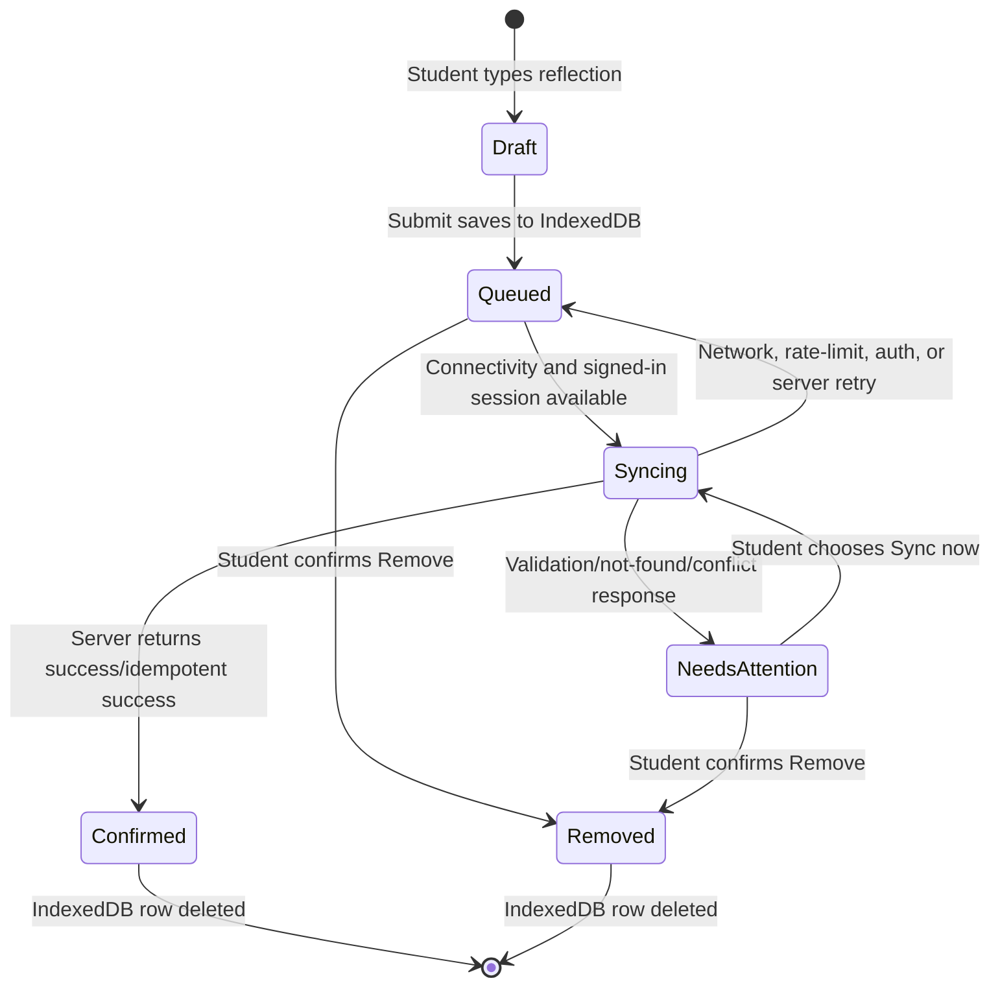

# PWA and offline synchronization

## Supported offline behavior

The app is installable and preserves a student's activity submission before attempting a network
request. Reflection text, selected photo, activity/student IDs, retry metadata, and an idempotent
client UUID are stored in IndexedDB. The local record is deleted only after the server confirms that
the work exists in Supabase.

The system does **not** cache authenticated HTML or API responses containing student data. If an
uncached protected page is opened offline, the user receives the static offline page. Activity data
already rendered in an open page remains usable, and queued work survives navigation, browser
restart, and installed-PWA restart subject to browser storage policies.

## Local storage model

| Storage                                       | Data                                                                                                                                                                    | Lifetime                                                              |
| --------------------------------------------- | ----------------------------------------------------------------------------------------------------------------------------------------------------------------------- | --------------------------------------------------------------------- |
| `localStorage`                                | In-progress reflection text per student/activity.                                                                                                                       | Until submit, browser data removal, or explicit application removal.  |
| Cookie `lsk-locale`                           | Chosen interface language (`en` or `id`).                                                                                                                               | One year, or until the reader switches language.                      |
| IndexedDB `lsk-offline` / `submission-outbox` | Complete queued submission, including photo Blob, retry state, and the last failure as a dictionary key (`lastErrorKey`, `lastErrorValues`) alongside its English text. | Until confirmed sync, explicit removal, or browser/site-data removal. |
| Service-worker caches                         | Offline page, icons, scripts, styles, fonts, and images.                                                                                                                | Versioned; old LSK caches are deleted on worker activation.           |

No password, Supabase key, JWT, or auth cookie is written to IndexedDB by queue code. Browser cookies
continue to manage the signed-in session.

Storing the last failure as a dictionary key rather than a sentence is what lets a queued
submission's status re-render in the reader's current language, however long it waits. The service
worker records keys and never translates; it has no dictionary.

`lsk-locale` is deliberately **not** `httpOnly`, because `public/offline.html` is a precached,
dependency-free page with no server render and `document.cookie` is its only way to pick a language.
The cookie carries no authorization meaning, so script access to it grants nothing. The page ships
Indonesian markup — correct with JavaScript disabled — and swaps to English when the cookie says so.
If a Content Security Policy is ever introduced, that inline script will need a hash or nonce.

## Queue states

HTTP `400`, `404`, `409`, `413`, and `422` responses mark an item `needs_attention`. Authentication,
rate-limit, connectivity, and server failures remain retryable. A `403` is retained because it often
means the work belongs to a different account on a shared device. The server validates the current
JWT against the queued student UUID before any write.

## Synchronization triggers

Foreground sync runs when:

- a student submits while online;
- the browser emits `online`;
- the page or installed app receives focus;
- the page becomes visible or resumes through `pageshow`;
- the app first mounts while online; or
- the student presses the waiting/sync button.

Where supported, the app also registers the service-worker Background Sync tag
`lsk-submission-sync`. iPhone/iPad behavior is more limited, so reopening or resuming the PWA after
reconnecting is the reliable fallback.

Browsers do not expose a dependable cross-platform test for “Wi-Fi only.” The current implementation
syncs over any usable connection. A Wi-Fi-only policy would need an explicit product decision and
must still account for unavailable or unreliable Network Information API data.

## Idempotency and concurrency

- Each queue row receives `crypto.randomUUID()` before any network request.
- The UUID becomes `submissions.client_submission_id`.
- `(student_id, client_submission_id)` is unique in PostgreSQL.
- `(student_id, activity_id)` is unique while status is pending/approved.
- Storage uses the same UUID in a deterministic student-owned object path.
- Duplicate object or database responses are checked and treated as success when the corresponding
  submission already exists.
- Foreground sync work is serialized per student account. A manual retry that includes
  `needs_attention` is queued after an existing automatic sync rather than being silently ignored.

These rules cover the failure where the database commits successfully but the response is lost.

## Service-worker caching

| Request                                  | Strategy                                                    |
| ---------------------------------------- | ----------------------------------------------------------- |
| Navigation                               | Network only, then static `/offline.html` fallback.         |
| JavaScript, CSS, manifest                | Network first; successful responses update the asset cache. |
| Fonts and images                         | Cache first with a background network fill when absent.     |
| Cross-origin, range, or non-GET requests | Not intercepted.                                            |
| Submission POST                          | Sent explicitly by outbox sync; never cached.               |

Worker cache names include a version. Any change to worker behavior or precached assets SHOULD bump
both cache version suffixes so old assets are removed during activation. The bilingual release moved
both to `v5`, because `/offline.html` is precached and its bytes changed, and because the worker now
records message keys.

The manifest is cached network-first and is therefore deliberately static and bilingual rather than
locale-aware. A manifest cannot follow the cookie in any case: browsers fetch it with credentials
omitted unless the `<link>` carries `crossorigin="use-credentials"`, and the operating system
captures the application name at install time.

## Privacy and device handling

IndexedDB is origin-isolated but not application-encrypted. Anyone who can use an unlocked device
and browser profile may be able to open the signed-in app or inspect local site data. Pilot operating
procedures SHOULD require device locks, deliberate sign-out on shared devices, appropriate consent
for student photos, and removal of abandoned queue records. Browser/site-data clearing permanently
deletes unsynced work.

The app requests persistent browser storage, but the browser may deny it. Storage quotas vary by
device. The UI validates individual photos at 3 MB; operators should still test low-storage devices
used in the pilot.

## Manual verification

1. Sign in as a student while online and open an incomplete field activity.
2. Enter at least ten reflection characters and choose a supported photo under 3 MB.
3. Switch developer tools to Offline and submit.
4. Verify “Saved on this device” and the waiting count.
5. Navigate within the already loaded app and reopen the activity; verify the reflection/photo queue
   state persists.
6. Close and reopen the installed PWA; verify the count remains.
7. Restore connectivity. Verify sync completes and the local queue row disappears.
8. Sign in as the assigned teacher and verify the pending reflection and private photo.
9. Approve it and verify the student receives the explorer badge.
10. Repeat with an online activity; verify it needs no photo and earns a learning badge after sync.
11. Queue work, sign in as another student on the same device, and verify the server refuses to
    upload the first student's row.
12. Test invalid type, photo over 3 MB, returned submission, manual retry, and explicit removal.

Run the database migration and readiness check before this test. See
[Database and security](database-and-security.md#migration-procedure).
